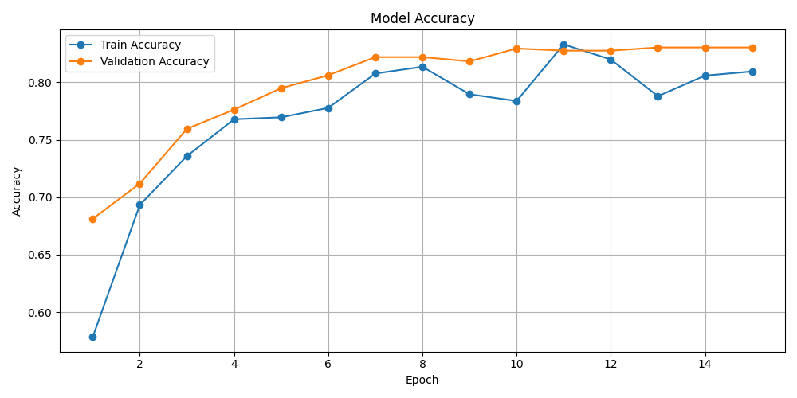
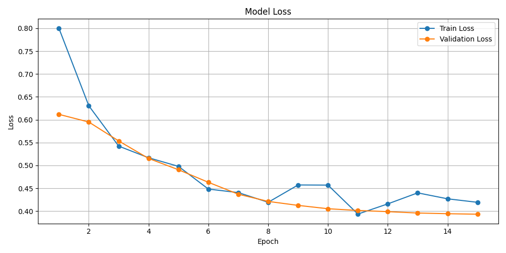

# Deepfake Detection with EfficientNetB3

This project uses deep learning to detect deepfake face images. Deepfakes pose a growing threat in digital misinformation, identity theft, and media manipulation. Our tool enables users to upload a face image and receive a prediction on whether the image is real or AI-generated — with confidence metrics and visual results.

---

## Demo

**Live App:** [Streamlit Demo](https://fakeface.streamlit.app/)  
**GitHub Repository:** [NessLloyd/Deepfake](https://github.com/NessLloyd/Deepfake)

---

## How It Works

1. The user uploads a face image (.jpg, .jpeg, or .png).
2. The image is preprocessed and resized to 224×224.
3. A pretrained EfficientNetB3 model predicts whether the image is **Real** or **Fake**.
4. The model outputs a probability score (e.g., 96.87% confidence that it's fake).
5. The result is visually displayed alongside the input image.

---

## Model Training Overview

We fine-tuned **EfficientNetB3**, a powerful CNN architecture known for its balance of speed and accuracy. Here's how the model was trained:

| **Parameter**       | **Value**              |
|---------------------|------------------------|
| Input Size          | 224 × 224              |
| Batch Size          | 32                     |
| Optimizer           | Adam                   |
| Learning Rate       | 0.001                  |
| Dropout Layers      | 0.4 & 0.3              |
| Epochs              | ~30 (early stopped)    |
| Loss Function       | Binary Crossentropy    |
| Dataset             | Custom + DFDC subset   |
| Labels              | `0 = Fake`, `1 = Real` |

We applied:
- **Data Augmentation:** Random flips, brightness, contrast
- **Class Balancing:** Undersampling or weighted loss to reduce bias
- **Validation Strategy:** 80/20 train/val split

---

## Training Performance

Here are the performance graphs for accuracy and loss during training:

<p align="center">
  
  
</p>

- **Final Validation Accuracy:** 83.04%  
- **ROC AUC Score:** 0.91  
- **Average Precision Score:** 0.91

---

## Folder Structure

```
.
├── app.py                  # Streamlit app
├── best_model.keras        # Trained model weights
├── accuracy_curve.png      # Training accuracy chart
├── loss_curve.png          # Training loss chart
├── gallery/                # Sample prediction images
└── README.md
```

---

## Technologies Used

- **Python**
- **TensorFlow / Keras**
- **EfficientNetB3**
- **Streamlit** (for interactive web UI)
- **Matplotlib** (for training graphs)
- **PIL / OpenCV** (for image handling)

---

## Contributors

**Team Members:**
- Vanessa Lloyd  
- Vireak Sroeung  
- George Battikha  
- Zachary Heffernan  
- Luke Andriopoulos

---
 
